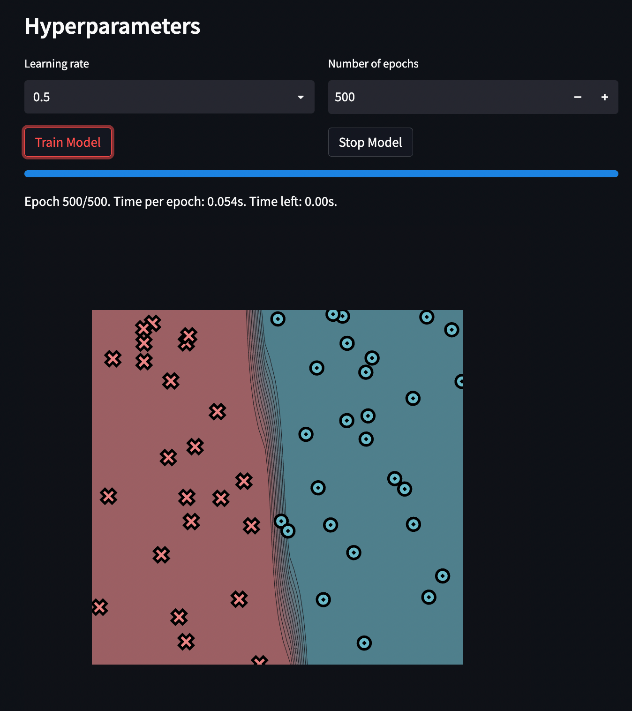
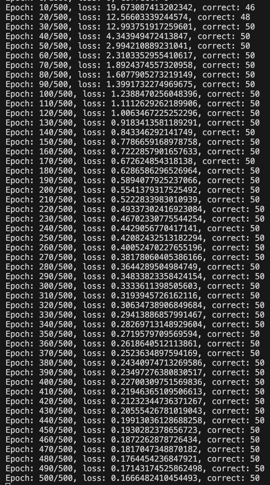

[](https://classroom.github.com/a/KaAmP7Zd)
[](https://classroom.github.com/online_ide?assignment_repo_id=11799163&assignment_repo_type=AssignmentRepo)
# MiniTorch Module 1


* Docs: https://minitorch.github.io/

* Overview: https://minitorch.github.io/module1/module1/

This assignment requires the following files from the previous assignments. You can get these by running

```bash
python sync_previous_module.py previous-module-dir current-module-dir
```

The files that will be synced are:

        minitorch/operators.py minitorch/module.py tests/test_module.py tests/test_operators.py project/run_manual.py

Simple Dataset:
Size of hidden layers: 2





Diag Dataset:
Size of hidden layers: 2


Split Dataset:
Size of hidden layers: 8


XOR Dataset:
Size of hidden layers: 10


