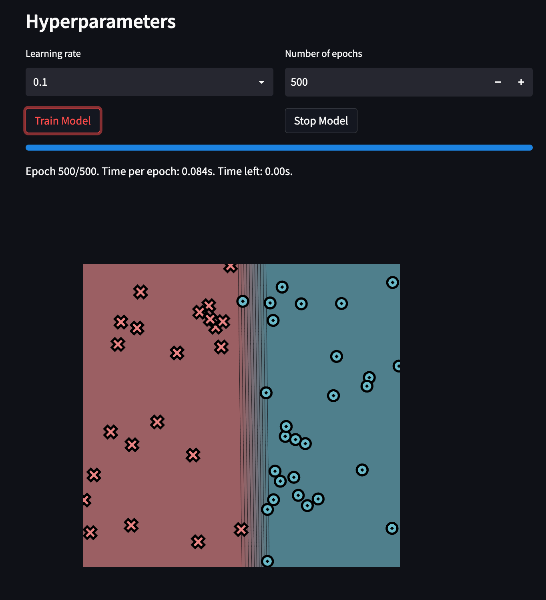
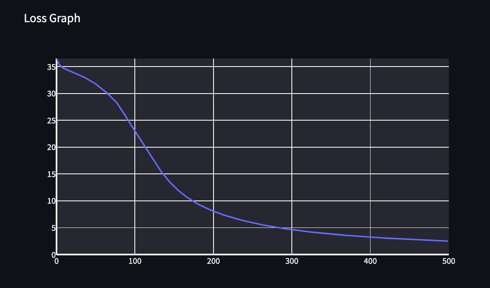
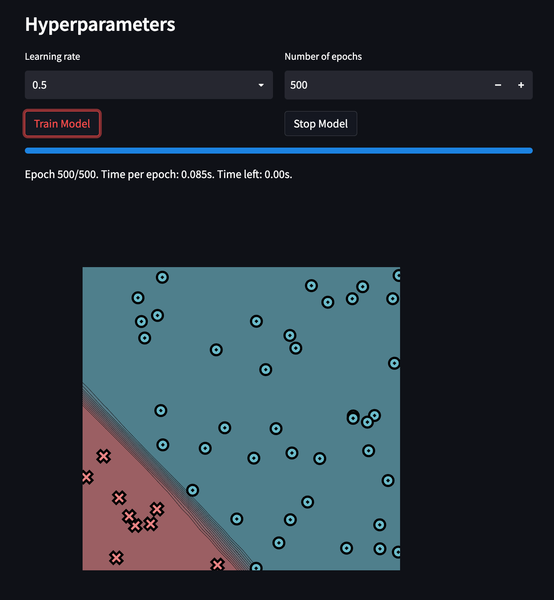
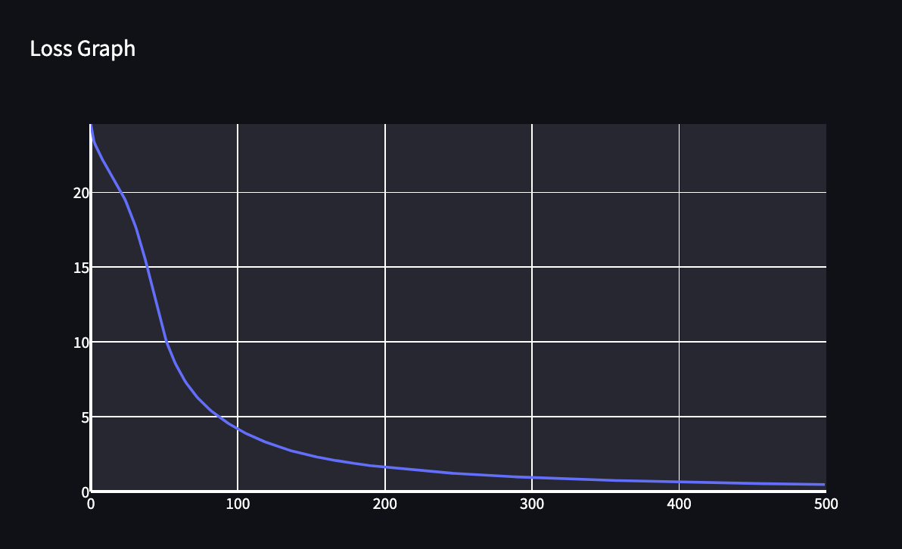
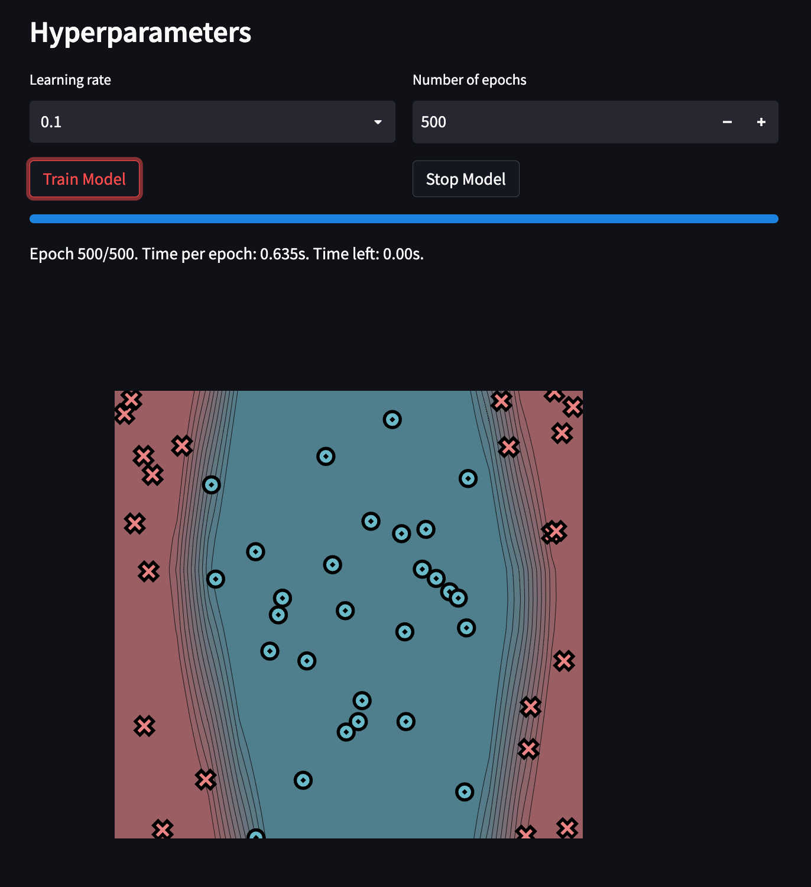
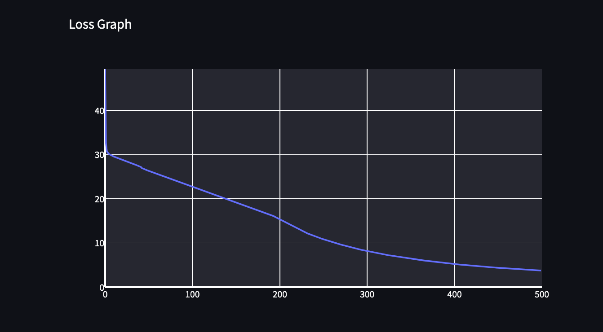
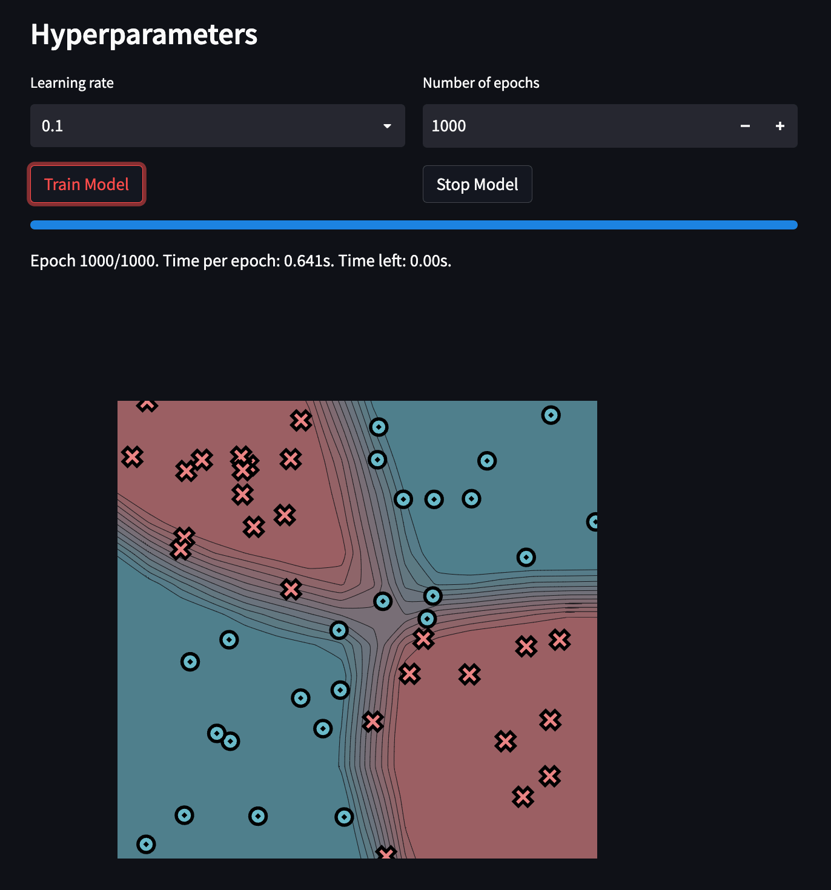
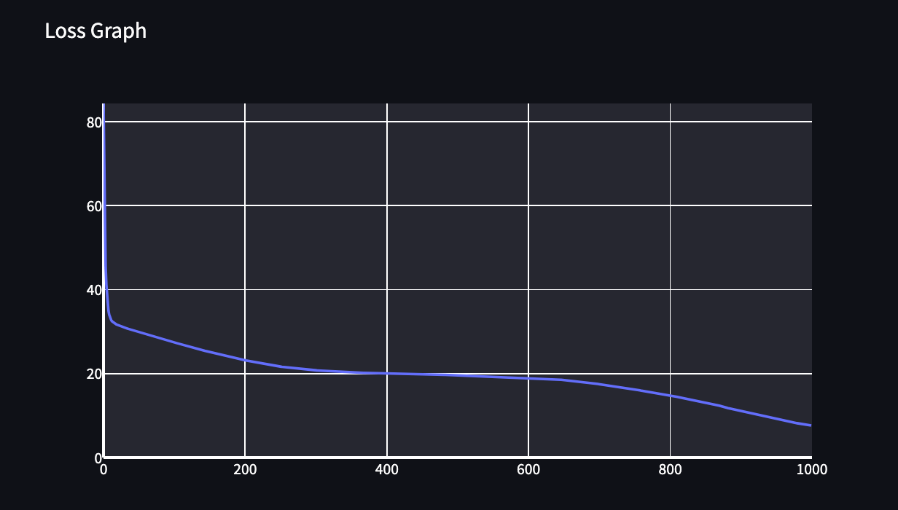

[](https://classroom.github.com/a/4jfBqlei)
[](https://classroom.github.com/online_ide?assignment_repo_id=12051333&assignment_repo_type=AssignmentRepo)
# MiniTorch Module 2


* Docs: https://minitorch.github.io/

* Overview: https://minitorch.github.io/module2/module2/

This assignment requires the following files from the previous assignments. You can get these by running

```bash
python sync_previous_module.py previous-module-dir current-module-dir
```

The files that will be synced are:

        minitorch/operators.py minitorch/module.py minitorch/autodiff.py minitorch/scalar.py minitorch/module.py project/run_manual.py project/run_scalar.py

# Simple Dataset:
## Parameters and Plot:
Hidden Layers: 4


## Loss Graph:

## Log:
Text file of logs is [here](results/logs/simple_log.txt)
# Diag Dataset:
## Parameters and Plot:
Hidden Layers: 4

## Loss Graph:

## Log:
Text file of logs is [here](results/logs/diag_log.txt)

# Split Dataset:
## Parameters and Plot:
Hidden Layers: 16

## Loss Graph:

## Log:
Text file of logs is [here](results/logs/split_log.txt)
# XOR Dataset:
## Parameters and Plot:
Hidden Layers: 16

## Loss Graph:

## Log:
Text file of logs is [here](results/logs/xor_log.txt)