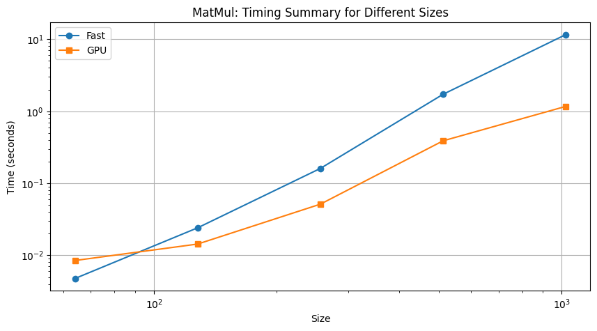

[](https://classroom.github.com/a/vYQ4W4rf)
# MiniTorch Module 3


* Docs: https://minitorch.github.io/

* Overview: https://minitorch.github.io/module3.html


You will need to modify `tensor_functions.py` slightly in this assignment.

* Tests:

```
python run_tests.py
```

* Note:

Several of the tests for this assignment will only run if you are on a GPU machine and will not
run on github's test infrastructure. Please follow the instructions to setup up a colab machine
to run these tests.

This assignment requires the following files from the previous assignments. You can get these by running

```bash
python sync_previous_module.py previous-module-dir current-module-dir
```

The files that will be synced are:

        minitorch/tensor_data.py minitorch/tensor_functions.py minitorch/tensor_ops.py minitorch/operators.py minitorch/module.py minitorch/autodiff.py minitorch/module.py project/run_manual.py project/run_scalar.py project/run_tensor.py

# 3.1 Parallel Check
Text file of logs is [here](results/logs/parallel_check_log.txt)

# 3.4 MatMul Timing Graph Comparison


# Simple Dataset:
## GPU
Text file of logs is [here](results/logs/simple_log_gpu.txt) \
Total time: 1240.620s\
Avg epoch time: 2.481s

## CPU
Text file of logs is [here](results/logs/simple_log_cpu.txt) \
Total time: 147.486s \
Avg epoch time: 0.295s 

# Split Dataset:
## GPU
Text file of logs is [here](results/logs/split_log_gpu.txt) \
Total time: 1242.888s \
Avg epoch time: 2.486s

## CPU
Text file of logs is [here](results/logs/split_log_cpu.txt) \
Total time: 144.177s \
Avg epoch time: 0.288s

# XOR Dataset:
## GPU
Text file of logs is [here](results/logs/xor_log_gpu.txt) \
Total time: 1237.851s\
Avg epoch time: 2.476s

## CPU
Text file of logs is [here](results/logs/xor_log_cpu.txt)\
Total time: 142.698s\
Avg epoch time: 0.285s

# Big Dataset Comparison (Simple)
## GPU
Text file of logs is [here](results/logs/big_simple_log_gpu.txt) \
Total time: 1227.249s\
Avg epoch time: 2.454s

## CPU
Text file of logs is [here](results/logs/big_simple_log_cpu.txt)\
Total time: 211.532s\
Avg epoch time: 0.423s